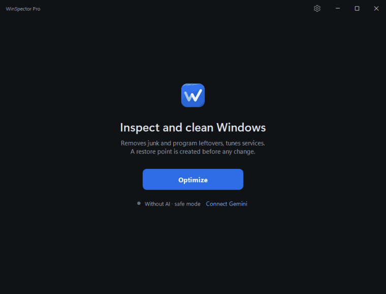
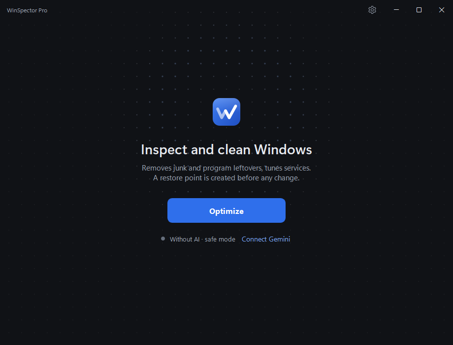
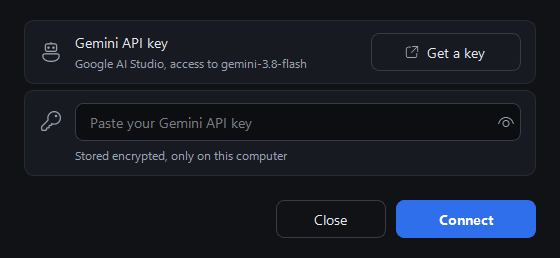
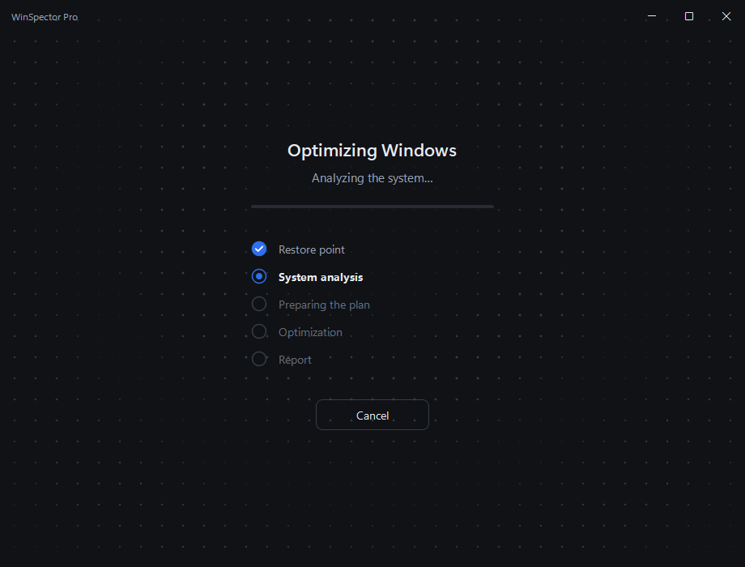
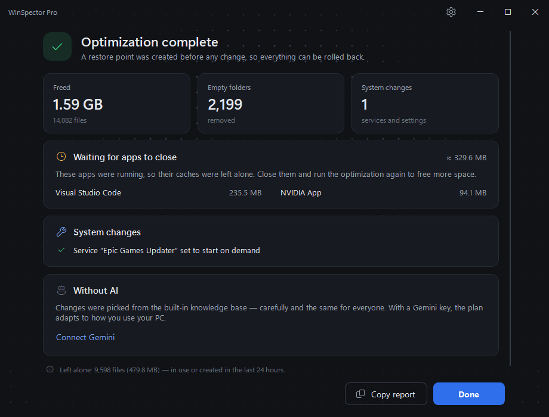

<p align="center">
  
  <a href="./README_RU.md"></a>
</p>

<p align="center">
  <picture>
    <source media="(prefers-color-scheme: dark)" srcset="./assets/logo-dark.png"/>
    
  </picture>
</p>

<h3 align="center">Open-source Windows optimizer with AI-assisted personalization</h3>

<p align="center">
  WinSpector Pro cleans junk, removes leftovers of uninstalled programs and tunes background
  services on Windows 10/11. Google Gemini tailors the plan to how you use your PC — the app's
  own code decides what is actually allowed to run.
</p>

<p align="center">
  <a href="https://github.com/deeCaTofficial/WinSpectorPro/releases/latest"></a>
  <a href="https://github.com/deeCaTofficial/WinSpectorPro/stargazers"></a>
</p>

<p align="center">
  
  <a href="./LICENSE"></a>
  
  
  <a href="https://github.com/deeCaTofficial/WinSpectorPro/releases/latest"></a>
  <a href="https://github.com/deeCaTofficial/WinSpectorPro/releases"></a>
  <a href="https://github.com/deeCaTofficial/WinSpectorPro/actions/workflows/ci.yml"></a>
</p>

|  |  |
| --- | --- |
| **Platform** | Windows 10 / 11 (x64), administrator rights |
| **Distribution** | Portable: one `WinSpectorPro.exe`, nothing to install or unpack |
| **AI** | Optional. A free Gemini API key personalizes the plan; without it the app uses its built-in knowledge base |
| **Source code** | MIT license, everything in this repository |
| **Interface language** | Russian and English; Windows display language is selected on first launch, with manual choice in Settings |

> [!TIP]
> **New in 1.1.0 — a major update.** Cleanup finds much more but deletes only what programs
> recreate; leftovers of uninstalled programs go to a 30-day quarantine; a redesigned
> interface with a new logo, an English UI, a Settings window and a clear card-based report.
> Read the [release notes](https://github.com/deeCaTofficial/WinSpectorPro/releases/tag/v1.1.0)
> or the [changelog](./CHANGELOG.md).

---

## Demo

<p align="center">
  
</p>
<p align="center"><sub>A real run on a working PC, recorded from the app itself (processing sped up). Every number in the report is from that run.</sub></p>

## Screenshots

<!-- Captured from the real app by scripts/capture_media.py; see docs/media/README.md. -->

| Main screen | Connecting Gemini (optional) |
| :---: | :---: |
|  |  |
| **System analysis** | **Report** |
|  |  |

## Quick start

1. **Download** `WinSpectorPro.exe` from the [latest release](https://github.com/deeCaTofficial/WinSpectorPro/releases/latest).
   This single file is the whole program.
2. **Run** `WinSpectorPro.exe` and confirm the administrator prompt.
   The EXE is not code-signed yet, so Windows SmartScreen may show a warning:
   click **More info → Run anyway**, or [verify the file](#verify-the-download) first.
3. **Optionally connect Gemini** in **Settings → Gemini**. The main screen opens immediately,
   and the app uses its built-in knowledge base when no key is configured.
   The key is free at [Google AI Studio](https://aistudio.google.com/apikey); a Google account
   and age 18+ are required, and the Gemini API is
   [not available in every country](https://ai.google.dev/gemini-api/docs/available-regions),
   including Russia and Belarus. The app checks the key with one short request before saving
   it, so a wrong key or an unsupported region is reported right away.
   You can connect Gemini at any time from Settings or the main screen.
4. **Start the analysis** with **Optimize** and wait for the report.

### Running without Gemini

Without a key the plan comes from the built-in knowledge base and is deliberately more cautious
than the AI plan. At startup, the app requests only the latest release metadata from GitHub to
check for updates; system analysis data is not sent without a Gemini key:

- the most conservative profile is used (`HomeUser`);
- only rules marked `safety: high` are applied;
- services are switched to *Manual* start, never disabled;
- built-in Store (UWP) apps are not removed;
- only junk categories marked `safety: high` are cleaned.

If a key is set but Gemini is unavailable (network, quota, outage), the run continues offline
automatically.

### Updates

After the window opens, the app checks the latest published GitHub release. A newer version
shows a clickable notice at the bottom of the window. **Settings → General** shows the installed
and latest versions, offers a manual check, and links to the release page. Updates are not
downloaded or installed automatically.

### Verify the download

Release notes list the SHA-256 checksum of `WinSpectorPro.exe` (from v1.1.0 on, also as a
`WinSpectorPro.exe.sha256` file next to the EXE). Compare it with the hash of your copy:

```powershell
Get-FileHash .\WinSpectorPro.exe -Algorithm SHA256
```

When available, the release notes also link to a VirusTotal scan of that exact file.
Executables packed with PyInstaller are sometimes flagged by antivirus heuristics; if in doubt,
build the EXE yourself from source (see [Build from source](#build-from-source)).

## How it works

```text
Restore point → System scan → User/system profile → AI analysis → Safety validation → Optimization plan → Execution → Report
```

The AI personalizes the recommendations; the application code controls everything that
changes the system.

| Step | In charge | What happens |
| --- | --- | --- |
| Restore point | Code | A Windows restore point is created; if that fails, nothing is changed |
| System scan | Code | Hardware, installed programs, services, junk and leftovers are collected (read-only) |
| Profile | AI | Gemini picks one or more profiles, e.g. `Gamer` + `Developer`. Without AI: `HomeUser` |
| AI analysis | AI | Gemini proposes service/app changes and answers “clean or not” per junk category |
| Safety validation | Code | [`plan_validator.py`](./src/winspector/core/modules/plan_validator.py) drops anything unsafe (see below) |
| Execution | Code | Only validated actions run; the files to delete come from the app's own scanner |
| Report | AI / code | What was freed, skipped and quarantined. Without AI the report is generated locally |

## Safety & transparency

WinSpector Pro changes system settings and deletes files, so it is built on the assumption that
**the AI is not a trusted source of commands.** What the code enforces:

- **Independent validation of every AI answer.** The plan from Gemini passes checks that do not
  rely on AI output: a strict identifier pattern, a whitelist of action and object types, a
  hard-coded list of critical services and Store apps that cannot be changed, and protections
  from the knowledge base (`safety: critical`, per-profile protections). See
  [`plan_validator.py`](./src/winspector/core/modules/plan_validator.py).
- **The AI does not choose files.** The list of files to delete is built by the app's own scanner
  from [built-in rules](./src/winspector/data/knowledge_base/cleanup_rules.yaml). Gemini only
  answers “clean this category or not”; any paths in its answer are ignored.
- **Protected locations.** Drive roots, Windows system folders, your personal folders
  (Documents, Downloads, Desktop, …), Defender quarantine and the Store and Visual Studio package
  caches are excluded in code ([`smart_cleaner.py`](./src/winspector/core/modules/smart_cleaner.py)).
  Cleanup deletes only caches, logs, temporary files and crash dumps — data that programs
  recreate or no longer need. Caches of running programs and recent files are skipped.
- **Leftovers go to quarantine, not to the void.** Folders of uninstalled programs are moved to
  `%LOCALAPPDATA%\WinSpectorPro\Quarantine` for 30 days and can be moved back.
- **Restore point first.** A Windows restore point is created before any change. If it cannot be
  created, the run stops. The only exception is Windows' own limit of one restore point per
  24 hours, when a recent point already exists.
- **Your Gemini key stays on your PC.** It is encrypted with Windows DPAPI in
  `%LOCALAPPDATA%\WinSpectorPro\credentials.dat` and can be decrypted only by the same Windows
  user on the same computer ([`credentials.py`](./src/winspector/core/credentials.py)). It is
  sent only to Google, with requests to Gemini.
- **What is sent to Gemini** (only when a key is set): hardware summary, names of installed
  programs and shortcuts, selected environment variables (e.g. `PATH`, which may contain your
  user name), whether your personal folders are empty, lists of services and Store apps, junk
  category names and report metrics with folder names (not full paths). File contents are never
  read or sent. On the free tier, Google may use this data to improve its products, and human
  reviewers may read it ([Gemini API terms](https://ai.google.dev/gemini-api/terms)); if that
  is not acceptable, use the app without AI.
- **Works without AI** — see [Running without Gemini](#running-without-gemini).
- **Open source.** All of the above can be checked in the code. A dry run shows what the cleanup
  would delete on your machine without deleting anything:
  `python scripts/audit_cleanup.py --out audit.md`.

**Limits.** No optimizer can guarantee that nothing goes wrong on every system: use the restore
point if something misbehaves. The EXE is not code-signed yet. The app needs administrator rights
and works only on Windows.

## Features

- 🧹 **Junk cleanup:** temporary files, Windows Update cache, crash reports, browser caches
  (Chrome, Edge, Firefox, Yandex — all profiles), caches of Telegram, Discord and other apps,
  logs, old shader and icon caches. Caches of running programs wait until they are closed.
- 🗂️ **Leftovers of uninstalled programs:** folders found only with evidence that the program is
  gone, orphaned installer copies, old app versions after updates, empty program folders —
  moved to a 30-day quarantine and restorable from **Settings → Quarantine**.
- ⚙️ **Service and Store app tuning** for your profiles, with reversible *Manual* start preferred
  over disabling.
- 🤖 **Optional Gemini personalization** that falls back to the built-in knowledge base when
  there is no key or no connection.
- 📊 **Clear report:** freed space, programs that held back their caches and how much they will
  free once closed, system changes, quarantine and Gemini's notes. Only really deleted bytes
  count as freed.
- 🌐 **English and Russian interface**, a Settings window and an update check that never
  installs anything by itself.

## Build from source

Requires Windows 10/11 and Python 3.12+ (development uses 3.14).

```powershell
python -m venv .venv
.venv\Scripts\pip install -r requirements-dev.txt
copy .env.example .env    # optional: GEMINI_API_KEY for development
.venv\Scripts\python src/main.py

# Tests and linter
.venv\Scripts\pytest tests/ --cov
.venv\Scripts\ruff check src/ scripts/ tests/

# Build dist\WinSpectorPro.exe and dist\WinSpectorPro.exe.sha256
.venv\Scripts\python scripts/build.py
```

## Documentation

- [User guide](./docs/USER_GUIDE.md) · [Руководство пользователя](./docs/USER_GUIDE_RU.md)
- [Architecture](./docs/ARCHITECTURE.md) (in Russian)
- [Contributing](./CONTRIBUTING.md) (in Russian; issues and pull requests in English are welcome)
- [Changelog](./CHANGELOG.md) and [Releases](https://github.com/deeCaTofficial/WinSpectorPro/releases)

## Roadmap

A draft: scope and dates are not fixed.

- **v1.1 — UX, documentation, safety, stability** *(current release)*: English
  interface and a Settings window, a redesigned interface and report, update check, bilingual
  documentation, verifiable downloads, cleanup limited to regenerable data, leftovers with a
  30-day quarantine, Python 3.14 and updated dependencies. See the [changelog](./CHANGELOG.md).
- **v1.2 — broader optimization and profiles.** Candidates already mentioned in the project:
  - preview and confirmation of the plan before it runs (proposed in
    [#1](https://github.com/deeCaTofficial/WinSpectorPro/issues/1), not implemented yet);
  - blocking of known telemetry domains (a list exists in
    [`telemetry_domains.yaml`](./src/winspector/data/knowledge_base/telemetry_domains.yaml);
    not wired into the app yet);
  - more optimization rules and profiles — *to be defined*.
- **v2.0 — major development of the application** — *scope to be defined*.
- **Not scheduled:** code-signed releases.

## Contributing

Bug reports, ideas and pull requests are welcome — see [CONTRIBUTING.md](./CONTRIBUTING.md).
New cleanup rules must follow the rules in that guide: only data that programs recreate by
themselves.

## License

MIT — see [LICENSE](./LICENSE).

---
<p align="center">
  <em>Made with ❤️ under the <strong>CLC corporation</strong> brand<br>
  <a href="https://github.com/deeCaTofficial">@deeCaT</a></em>
</p>
