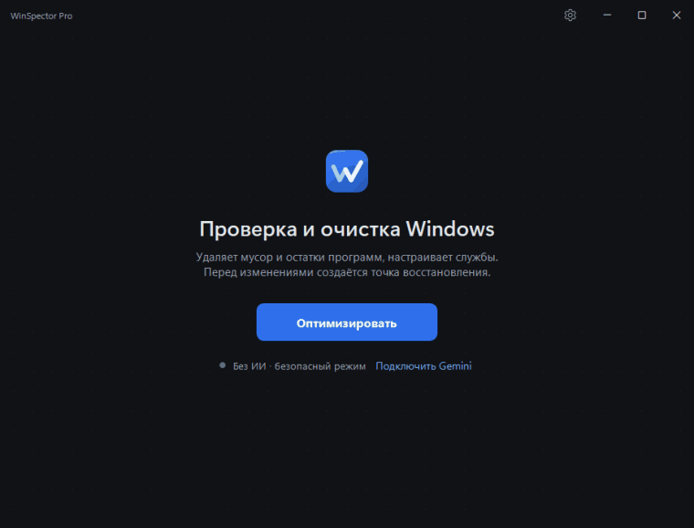
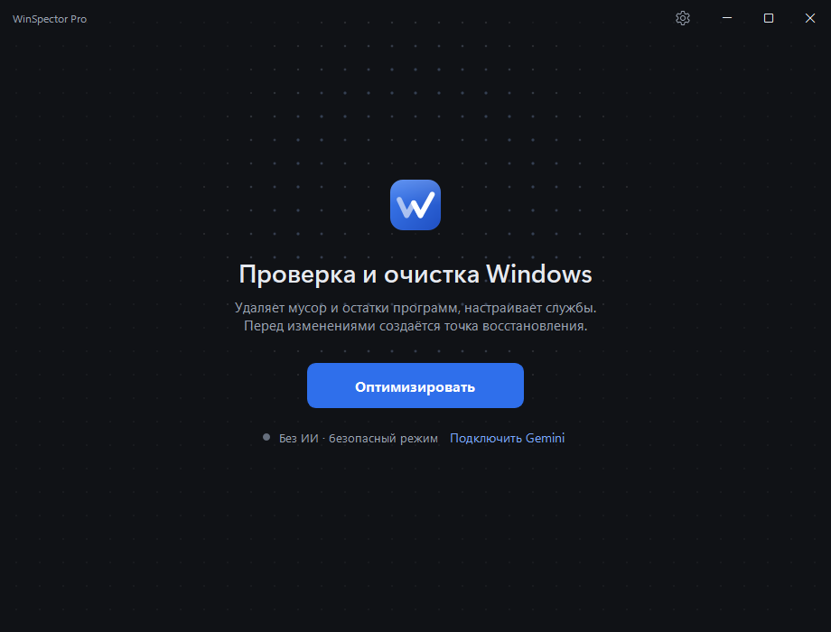
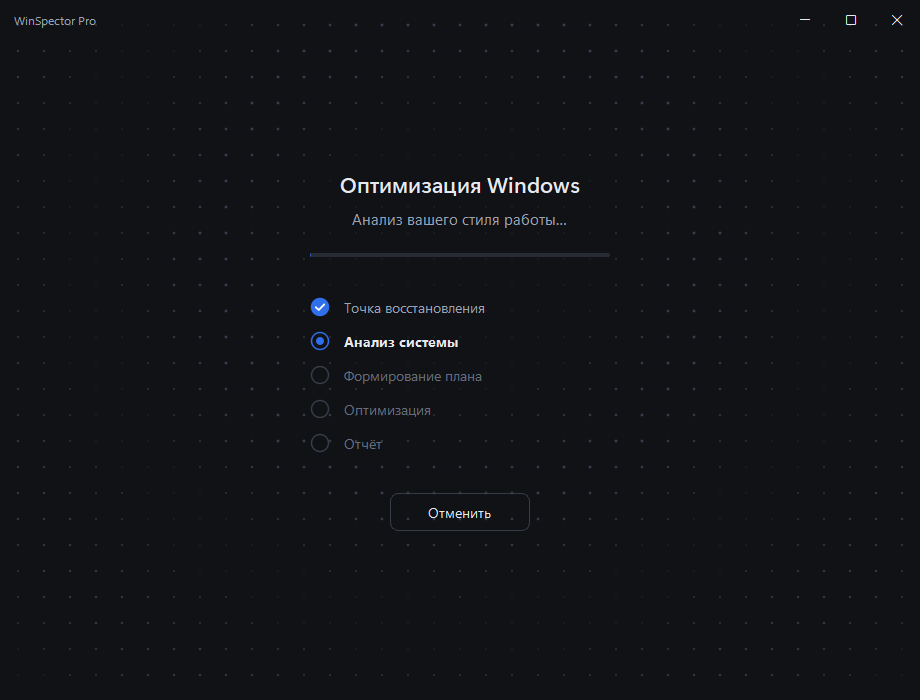
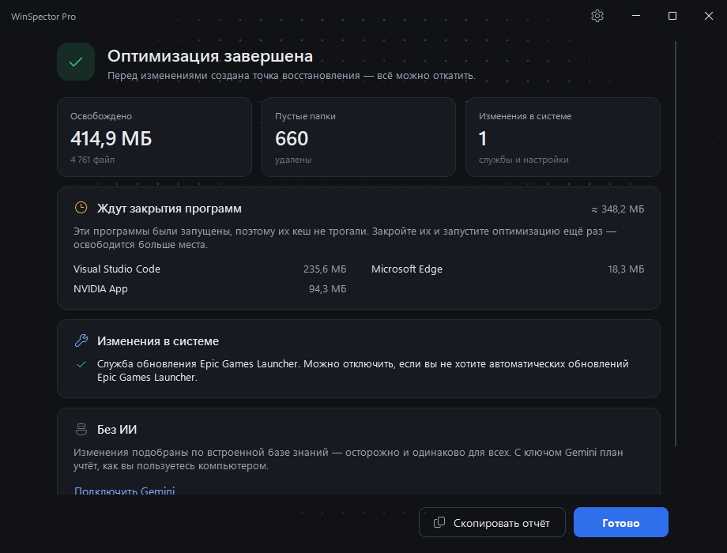

<p align="center">
  <a href="./README.md">English</a> | <b>Русский</b>
</p>

<p align="center">
  <picture>
    <source media="(prefers-color-scheme: dark)" srcset="./assets/logo-dark.png"/>
    
  </picture>
</p>

<h3 align="center">Оптимизатор Windows с открытым кодом и персонализацией на базе ИИ</h3>

<p align="center">
  WinSpector Pro очищает мусор, убирает остатки удалённых программ и настраивает фоновые службы
  Windows 10/11. Google Gemini подстраивает план под то, как вы пользуетесь компьютером, а что
  на самом деле можно выполнить — решает код приложения.
</p>

<p align="center">
  <a href="https://github.com/deeCaTofficial/WinSpectorPro/releases/latest"></a>
</p>

<p align="center">
  
  <a href="./LICENSE"></a>
  
  
  <a href="https://github.com/deeCaTofficial/WinSpectorPro/releases/latest"></a>
  <a href="https://github.com/deeCaTofficial/WinSpectorPro/actions/workflows/ci.yml"></a>
</p>

|  |  |
| --- | --- |
| **Система** | Windows 10 / 11 (x64), права администратора |
| **Поставка** | Портативная: один `WinSpectorPro.exe`, ничего не нужно устанавливать и распаковывать |
| **ИИ** | Необязателен. Бесплатный ключ Gemini делает план персональным; без него работает встроенная база знаний |
| **Исходный код** | Лицензия MIT, всё в этом репозитории |
| **Язык интерфейса** | Русский и английский; при первом запуске выбирается язык Windows, затем его можно сменить в настройках |

> [!TIP]
> **Новое в 1.1.0 — крупное обновление.** Очистка находит гораздо больше, но удаляет только
> то, что программы восстановят сами; остатки удалённых программ уходят в карантин на 30 дней;
> новый интерфейс с новым логотипом, английским языком, окном настроек и понятным отчётом из
> карточек. Подробнее — в [описании релиза](https://github.com/deeCaTofficial/WinSpectorPro/releases/tag/v1.1.0)
> и [истории изменений](./CHANGELOG.md).

---

## Демонстрация

<p align="center">
  
</p>
<p align="center"><sub>Настоящий запуск на рабочем ПК, записанный самой программой (обработка ускорена). Все цифры в отчёте — из этого запуска.</sub></p>

## Скриншоты

<!-- Сняты с настоящей программы скриптом scripts/capture_media.py; см. docs/media/README.md. -->

| Главный экран | Подключение Gemini (необязательно) |
| :---: | :---: |
|  |  |
| **Анализ системы** | **Отчёт** |
|  |  |

## Быстрый старт

1. **Скачайте** `WinSpectorPro.exe` из [последнего релиза](https://github.com/deeCaTofficial/WinSpectorPro/releases/latest).
   Этот файл — вся программа.
2. **Запустите** `WinSpectorPro.exe` и подтвердите запрос прав администратора.
   EXE пока не подписан цифровой подписью, поэтому Windows SmartScreen может показать
   предупреждение: нажмите **«Подробнее» → «Выполнить в любом случае»** или сначала
   [проверьте файл](#проверка-файла).
3. **По желанию подключите Gemini** в разделе **Настройки → Gemini**. Приложение сразу
   открывает главный экран и без ключа работает по встроенной базе знаний.
   Ключ бесплатный, его выдают в [Google AI Studio](https://aistudio.google.com/apikey); нужны
   аккаунт Google и возраст от 18 лет, а Gemini API доступен
   [не во всех странах](https://ai.google.dev/gemini-api/docs/available-regions), в частности его
   нет в России и Беларуси. Перед сохранением программа проверяет ключ одним коротким запросом,
   так что неверный ключ или неподдерживаемая страна видны сразу.
   Подключить Gemini можно в любое время через настройки или кнопку на главном экране.
4. **Запустите анализ** кнопкой «Оптимизировать» и дождитесь отчёта.

### Работа без Gemini

Без ключа план строится по встроенной базе знаний и намеренно осторожнее, чем план ИИ.
При запуске приложение запрашивает у GitHub только сведения о последнем релизе для проверки
обновлений; данные анализа системы без ключа Gemini в сеть не отправляются:

- используется самый осторожный профиль (`HomeUser`);
- применяются только правила с пометкой `safety: high`;
- службы переводятся в ручной запуск, а не отключаются;
- встроенные приложения Store (UWP) не удаляются;
- очищаются только категории мусора с пометкой `safety: high`.

Если ключ задан, но Gemini недоступен (сеть, квота, сбой сервиса), работа автоматически
продолжается офлайн.

### Обновления

После открытия окна программа проверяет последний опубликованный релиз на GitHub. Если версия
новее установленной, внизу окна появляется уведомление. Оно открывает **Настройки → Общие**,
где показаны обе версии и ссылка на страницу релиза. Проверку можно запустить вручную там же.
Программа не скачивает и не устанавливает обновление автоматически.

### Проверка файла

В описании релиза указан SHA-256 файла `WinSpectorPro.exe` (начиная с v1.1.0 — ещё и файлом
`WinSpectorPro.exe.sha256` рядом с EXE). Сравните его с хешем вашей копии:

```powershell
Get-FileHash .\WinSpectorPro.exe -Algorithm SHA256
```

Если есть, в описании релиза также приводится ссылка на проверку этого же файла в VirusTotal.
Антивирусы иногда эвристически помечают программы, упакованные PyInstaller; если сомневаетесь,
соберите EXE сами из исходников (см. [Сборка из исходников](#сборка-из-исходников)).

## Как это работает

```text
Точка восстановления → Сканирование системы → Профиль пользователя/системы → Анализ ИИ → Проверка безопасности → План оптимизации → Выполнение → Отчёт
```

ИИ отвечает за персонализацию рекомендаций, а всё, что меняет систему, контролирует код
приложения.

| Шаг | Кто отвечает | Что происходит |
| --- | --- | --- |
| Точка восстановления | Код | Создаётся точка восстановления Windows; если не удалось — ничего не меняется |
| Сканирование системы | Код | Собираются оборудование, программы, службы, мусор и остатки (только чтение) |
| Профиль | ИИ | Gemini выбирает один или несколько профилей, например `Gamer` + `Developer`. Без ИИ — `HomeUser` |
| Анализ ИИ | ИИ | Gemini предлагает изменения служб и приложений и отвечает «чистить или нет» по каждой категории мусора |
| Проверка безопасности | Код | [`plan_validator.py`](./src/winspector/core/modules/plan_validator.py) отбрасывает всё небезопасное (см. ниже) |
| Выполнение | Код | Выполняются только проверенные действия; файлы на удаление находит сканер самого приложения |
| Отчёт | ИИ / код | Что освобождено, пропущено и перенесено в карантин. Без ИИ отчёт формируется локально |

## Безопасность и прозрачность

WinSpector Pro меняет настройки системы и удаляет файлы, поэтому он исходит из того, что
**ИИ — не доверенный источник команд.** Что обеспечивает код:

- **Независимая проверка каждого ответа ИИ.** План от Gemini проходит проверки, которые не
  опираются на ответ модели: строгий шаблон идентификатора, белый список действий и типов
  объектов, зашитый в код список критических служб и приложений Store, которые нельзя менять,
  и защиты из базы знаний (`safety: critical`, защита для профилей). См.
  [`plan_validator.py`](./src/winspector/core/modules/plan_validator.py).
- **ИИ не выбирает файлы.** Список файлов на удаление составляет сканер приложения по
  [встроенным правилам](./src/winspector/data/knowledge_base/cleanup_rules.yaml). Gemini лишь
  отвечает «чистить эту категорию или нет»; пути в его ответе игнорируются.
- **Защищённые места.** Корни дисков, системные папки Windows, личные папки (Документы,
  Загрузки, Рабочий стол, …), карантин Defender и кеши пакетов Store и Visual Studio исключены
  кодом ([`smart_cleaner.py`](./src/winspector/core/modules/smart_cleaner.py)). Очистка
  удаляет только кеши, журналы, временные файлы и дампы сбоев — то, что программы создадут
  заново или что им больше не нужно. Кеши запущенных программ и свежие файлы пропускаются.
- **Остатки уходят в карантин, а не в никуда.** Папки удалённых программ переносятся в
  `%LOCALAPPDATA%\WinSpectorPro\Quarantine` на 30 дней, их можно вернуть на место.
- **Сначала точка восстановления.** Перед любыми изменениями создаётся точка восстановления
  Windows. Если создать её не удалось, работа прекращается. Единственное исключение — лимит
  самой Windows на одну точку в сутки, когда свежая точка уже есть.
- **Ключ Gemini остаётся на вашем компьютере.** Он зашифрован Windows DPAPI в
  `%LOCALAPPDATA%\WinSpectorPro\credentials.dat`, и расшифровать его может только та же
  учётная запись на том же компьютере ([`credentials.py`](./src/winspector/core/credentials.py)).
  Передаётся ключ только в Google — вместе с запросами к Gemini.
- **Что отправляется в Gemini** (только если ключ задан): сведения об оборудовании, названия
  установленных программ и ярлыков, некоторые переменные окружения (например, `PATH`, где может
  встречаться имя вашей учётной записи), пусты ли личные папки, списки служб и приложений Store,
  названия категорий мусора и итоги отчёта с именами папок (без полных путей). Содержимое
  файлов не читается и не отправляется. На бесплатном тарифе Google может использовать эти
  данные для улучшения своих продуктов, а проверяющие сотрудники — читать их
  ([условия Gemini API](https://ai.google.dev/gemini-api/terms)); если это неприемлемо,
  пользуйтесь программой без ИИ.
- **Работает без ИИ** — см. [Работа без Gemini](#работа-без-gemini).
- **Открытый код.** Всё перечисленное можно проверить в коде. Сухой прогон показывает, что
  очистка удалила бы на вашем компьютере, ничего не удаляя:
  `python scripts/audit_cleanup.py --out audit.md`.

**Ограничения.** Ни один оптимизатор не может гарантировать, что на любой системе всё пройдёт
гладко: если что-то пошло не так, используйте точку восстановления. EXE пока не подписан
цифровой подписью. Программе нужны права администратора, и она работает только в Windows.

## Возможности

- 🧹 **Очистка мусора:** временные файлы, кеш обновлений Windows, отчёты об ошибках, кеши браузеров
  (Chrome, Edge, Firefox, Яндекс — во всех профилях), кеши Telegram, Discord и других приложений,
  журналы, старый кеш шейдеров и значков. Кеш запущенных программ ждёт их закрытия.
- 🗂️ **Остатки удалённых программ:** папки, найденные только при явном признаке, что программы
  больше нет, ненужные копии установщиков, старые версии приложений после обновлений, пустые
  папки программ — всё уходит в карантин на 30 дней и возвращается из **Настройки → Карантин**.
- ⚙️ **Настройка служб и приложений Store** под ваши профили — с предпочтением обратимого ручного
  запуска перед отключением.
- 🤖 **Персонализация через Gemini — по желанию.** Без ключа или без интернета работает
  встроенная база знаний.
- 📊 **Понятный отчёт:** сколько освобождено, какие программы мешали очистке и сколько места
  освободится после их закрытия, изменения в системе, карантин и комментарий Gemini.
  Освобождённым считается только реально удалённое.
- 🌐 **Интерфейс на русском и английском**, окно настроек и проверка обновлений, которая
  ничего не устанавливает сама.

## Сборка из исходников

Нужны Windows 10/11 и Python 3.12+ (разработка ведётся на 3.14).

```powershell
python -m venv .venv
.venv\Scripts\pip install -r requirements-dev.txt
copy .env.example .env    # необязательно: GEMINI_API_KEY для разработки
.venv\Scripts\python src/main.py

# Тесты и линтер
.venv\Scripts\pytest tests/ --cov
.venv\Scripts\ruff check src/ scripts/ tests/

# Сборка dist\WinSpectorPro.exe и dist\WinSpectorPro.exe.sha256
.venv\Scripts\python scripts/build.py
```

## Документация

- [Руководство пользователя](./docs/USER_GUIDE_RU.md) · [User guide](./docs/USER_GUIDE.md)
- [Архитектура проекта](./docs/ARCHITECTURE.md)
- [Участие в разработке](./CONTRIBUTING.md)
- [История изменений](./CHANGELOG.md) (на английском) и [Релизы](https://github.com/deeCaTofficial/WinSpectorPro/releases)

## Дорожная карта

Черновик: состав и сроки не зафиксированы.

- **v1.1 — удобство, документация, безопасность, стабильность** *(текущий релиз)*:
  английский интерфейс и окно настроек, новый дизайн и отчёт, проверка обновлений, документация на двух языках,
  проверяемые загрузки, очистка только восстановимых данных,
  остатки программ с карантином на 30 дней, Python 3.14 и обновлённые зависимости. См.
  [историю изменений](./CHANGELOG.md).
- **v1.2 — расширение оптимизаций и профилей.** Кандидаты, которые уже упоминались в проекте:
  - предпросмотр и подтверждение плана перед выполнением (предложено в
    [#1](https://github.com/deeCaTofficial/WinSpectorPro/issues/1), пока не реализовано);
  - блокировка известных доменов телеметрии (список есть в
    [`telemetry_domains.yaml`](./src/winspector/data/knowledge_base/telemetry_domains.yaml),
    но к приложению пока не подключён);
  - новые правила оптимизации и профили — *будет определено*.
- **v2.0 — крупное развитие приложения** — *состав будет определён*.
- **Без срока:** релизы с цифровой подписью.

## Участие в разработке

Сообщения об ошибках, идеи и pull request'ы приветствуются — см. [CONTRIBUTING.md](./CONTRIBUTING.md).
Новые правила очистки должны соответствовать требованиям из этого руководства: только данные,
которые программы восстанавливают сами.

## Лицензия

MIT — см. [LICENSE](./LICENSE).

---
<p align="center">
  <em>Разработано с ❤️ под маркой <strong>CLC corporation</strong><br>
  <a href="https://github.com/deeCaTofficial">@deeCaT</a></em>
</p>
